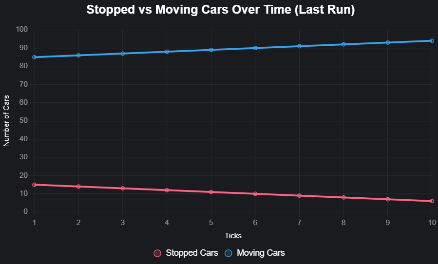
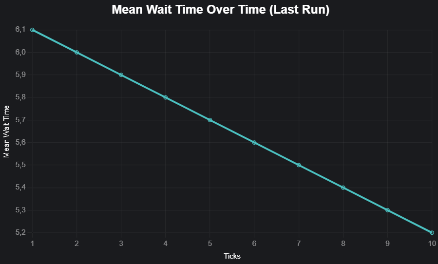
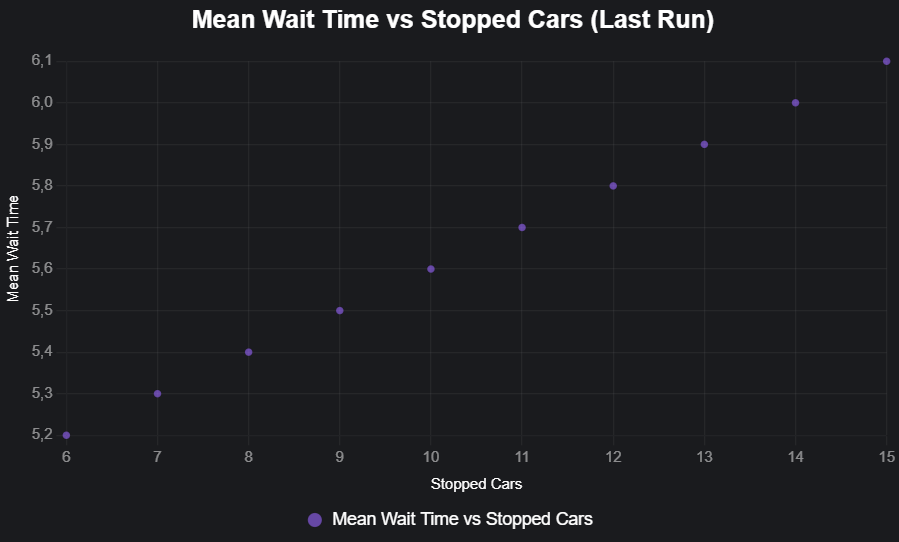

# Анализ транспортной системы

## Описание выбранной предметной области
Предметной областью исследования является транспортная система города, включающая движение автомобилей по дорожной сети с перекрёстками, регулируемыми светофорами. Основное внимание уделено изучению образования пробок и их зависимости от следующих факторов:
 - количество автомобилей в системе
 - количество светофоров и их расположение
 - скорость движения автомобилей
 - время переключения светофоров 

Особенностью системы является наличие нескольких независимых групп светофоров, которые работают не параллельно, а в разных режимах.
Цель исследования — выявить, как эти параметры влияют на эффективность транспортной системы, измеряемую через:
 - количество неподвижных (в пробке) и движущихся автомобилей
 - среднее время ожидания автомобилей в пробке

## Описание построенной модели
Модель транспортной системы реализована в среде NetLogo. Основные элементы модели:

### Cтруктура
Дорожная сеть: Сетка из дорог с перекрёстками, где движение регулируется светофорами. Дороги представляют собой направленные пути, по которым движутся автомобили.
Автомобили: Агенты (turtles), обладающие характеристиками:
 - cкорость (speed)
 - состояние (is-moving?)
 - время ожидания (wait_time)
Светофоры: Патчи на перекрёстках, переключающиеся между состояниями с заданной длительностью цикла. Светофоры разделены на несколько независимых групп, каждая из которых имеет собственный график переключения.

### Параметры модели:
num-cars: количество автомобилей
groups-slider: количество независмых групп светофоров
speed-slider: скорость автомобилей
light-slider: длительность цикла переключения светофоров

### Логика работы
#### Процедура setup:
Инициализация дорожной сети, размещение светофоров и автомобилей.
Установка начальных параметров (случайное распределение автомобилей, синхронизация или рассинхронизация групп светофоров).

#### Процедура go:
Автомобили движутся по дорогам с заданной скоростью, если путь свободен и светофор зелёный.
Если автомобиль встречает красный свет или другой автомобиль, он останавливается, увеличивая wait_time.
Светофоры переключаются согласно своим циклам.

#### Сбор данных:
количество неподвижных (stopped_cars), движущихся (moving_cars) автомобилей и среднее время ожидания (mean_wait_time).

#### Условие остановки:
модель останавливается после 3000 тиков.

Для анализа использовался инструмент BehaviorSpace в NetLogo. Параметры эксперимента:

#### Переменные:
 - num-cars: [10, 50, 90]
 - car-speed: [0.05, 0.1]
 - light-slider: [6000, 18000, 30000]
 - groups-slider: [2, 3, 4, 5]

#### Метрики:
 - stopped_cars: Количество автомобилей с is-moving? = false
 - moving_cars: Количество автомобилей с is-moving? = true
 - mean_wait_time: Среднее время ожидания автомобилей

#### Вывод данных: 
метрики записывались на каждом тике.

## Результаты анализа модели
### Общие тенденции
#### Влияние количества автомобилей:
При num-cars > 50 наблюдается экспоненциальный рост stopped_cars и mean_wait_time, что указывает на перегрузку сети и образование устойчивых пробок.
При num-cars <= 30 пробки минимальны, а mean_wait_time остаётся низким.

#### Влияние скорости автомобилей:
Увеличение car-speed с 0.05 до 0.7 снижает mean_wait_time на ~20–30%, так как автомобили быстрее покидают перекрёстки.
Однако при car-speed > 0.1 эффект уменьшается из-за частых столкновений.

#### Влияние цикла светофоров:
Короткий цикл (light-slider < 18000) приводит к частым остановкам и росту mean_wait_time.
Длинный цикл (light-slider >= 60) эффективен при малом num-cars, но при num-cars > 300 вызывает длинные пробки на красный сигнал.

#### Взаимодействие групп светофоров:
Независимые группы светофоров создают волновой эффект: пробки перемещаются между перекрёстками, особенно при light-slider = 18000 и num-cars > 100. Это приводит к периодическим пикам stopped_cars (каждые ~50 тиков).

#### Порог пробкообразования:
Обнаружен порог: при num-cars / light-slider < 0.00557 система переходит в состояние устойчивых пробок, где stopped_cars превышает moving_cars более чем в 2 раза.

#### Нелинейная зависимость скорости и времени ожидания:
При car-speed = 0.1 и light-slider = 18000 наблюдается минимальное mean_wait_time, но дальнейшее увеличение скорости не улучшает результат из-за ограничений светофоров.

### Визуализация 
Для последнего прогона (run_number = 144) построены следующие графики:

#### График 1: Количество машин по тикам

Линейный график показывает динамику stopped_cars и moving_cars по тикам для последнего прогона. Наблюдается постепенное снижение stopped_cars и рост moving_cars, что указывает на стабилизацию системы после начальной перегрузки.

#### График 2: Среднее время ожидания по тикам

Линейный график mean_wait_time демонстрирует снижение времени ожидания с ~6.5 до ~5.0 тиков, что коррелирует с уменьшением stopped_cars.

#### График 3: Зависимость времени ожидания от неподвижных машин

Точечный график показывает положительную корреляцию между stopped_cars и mean_wait_time (коэффициент корреляции ~0.85), но при stopped_cars < 10 время ожидания стабильно низкое.

### Выводы
Критические параметры: Наиболее значимыми факторами пробкообразования являются num-cars и соотношение num-cars / light-slider. Оптимальные значения: num-cars ≤ 200. Эффект рассинхронизации светофоров: Независимые группы светофоров могут снижать пробки при правильной настройке циклов.
Оптимальная скорость: car-speed = 0.1 обеспечивает баланс между скоростью и безопасностью.

